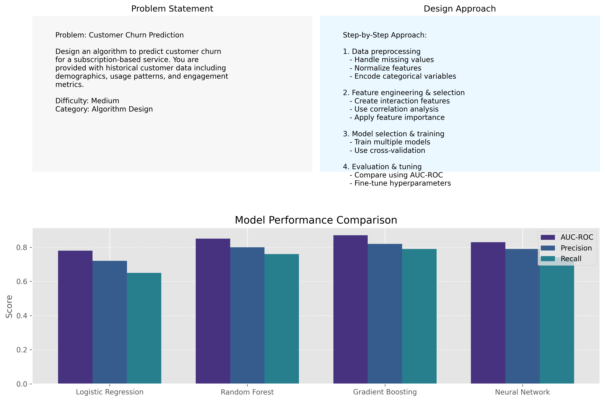

# AI Interview Mastery Trainer

An interactive training tool designed to help users master essential skills for AI Engineer interviews.

## Features

### 1. Coding Round (Algorithms & Data Structures)
- Practice algorithm and data structure-related coding questions
- Learn to analyze and optimize solutions
- Get detailed explanations and complexity analysis
- Compare your brute force and optimal solutions with reference implementations

### 2. AI/ML Theoretical Questions Round
- Test your knowledge on AI/ML fundamentals
- Multiple-choice questions with immediate feedback
- Clear explanations of correct answers
- Track your performance across different AI/ML topics

### 3. Algorithm Design for Predictive/Deep Learning Problems
- Design algorithms for real-world AI scenarios
- Learn optimal approaches for predictive/deep learning problems
- Get feedback on your solutions
- Study pseudocode implementations and evaluation criteria for ML algorithms

## Installation

1. Clone this repository:
```
git clone https://github.com/CodeQueenie/AI-Interview-Mastery-Trainer.git
cd AI-Interview-Mastery-Trainer
```

2. Install the required dependencies:
```
pip install -r requirements.txt
```

3. Run the application:
```
python run.py
```

Or directly with Streamlit:
```
streamlit run src/app.py
```

## Usage

1. Select the training mode you want to practice (Coding, Theory, or Algorithm Design)
2. Answer the questions presented to you
3. Review feedback and explanations
4. Track your progress over time through the interactive dashboard

## Project Structure

```
ai-interview-mastery-trainer/
├── data/
│   ├── coding_questions.py     # Coding problems with solutions
│   └── theory_questions.py     # AI/ML theoretical questions
├── src/
│   ├── app.py                  # Main Streamlit application
│   ├── dashboard.py            # Progress tracking dashboard
│   ├── utils.py                # Utility functions
│   └── visualizations.py       # Data visualization utilities
├── algorithm_design_questions.py  # Algorithm design problems
├── requirements.txt            # Project dependencies
├── run.py                      # Application launcher
└── README.md                   # Project documentation
```

## Module Details

### Coding Round

The `data/coding_questions.py` module contains a collection of coding problems focused on algorithms and data structures commonly asked in AI Engineer interviews. Each question includes:
- Problem statement with examples and constraints
- Hints to guide your thinking
- Brute force solution with time/space complexity analysis
- Optimal solution with detailed explanation
- Time and space complexity analysis

### Theory Round

The `data/theory_questions.py` module contains multiple-choice questions covering AI/ML fundamentals. Each question includes:
- Clear problem statement
- Multiple choice options
- Correct answer
- Detailed explanation of the concept

### Algorithm Design Round

The `algorithm_design_questions.py` module contains questions that challenge you to design algorithms for predictive and deep learning scenarios. Each question provides:
- Problem statement
- Hints for developing a solution
- Outline of an optimal design approach including pseudocode
- Key considerations for implementation
- Evaluation criteria for your solution

This module is integrated into the AI Interview Mastery Trainer, which provides a unified interface for practicing all three question types.

## Dashboard Features

The application includes a comprehensive dashboard that helps you track your progress:

- Summary statistics (questions attempted, accuracy, current streak)
- Performance insights (strengths and areas for improvement)
- Visualizations (category distribution, performance metrics, activity patterns)
- Personalized recommendations based on your performance
- Curated study resources for each topic area

## Technical Features

### Session Management
- SQLite-based session storage for reliable data persistence
- Import/export functionality for session data (JSON format)
- Performance data export for external analysis (CSV format)
- Database backup and restore capabilities

### Error Handling & Logging
- Comprehensive error handling throughout the application
- Centralized logging system with configurable log levels
- Function call tracing for easier debugging
- Detailed error context to quickly identify issues
- Log rotation with timestamps for better organization

### Dashboard & Analytics
- Summary statistics (questions attempted, accuracy, current streak)
- Performance insights (strengths and areas for improvement)
- Visualizations (category distribution, performance metrics, activity patterns)
- Personalized recommendations based on your performance
- Curated study resources for each topic area

## Visual Demonstrations

### Dashboard Overview

*The dashboard provides comprehensive analytics of your performance across all question types, helping you identify strengths and areas for improvement.*

### Coding Round Interface

*Practice algorithm and data structure problems with immediate feedback and complexity analysis.*

### Theory Round Interface

*Test your knowledge of AI/ML concepts with multiple-choice questions and detailed explanations.*

### Algorithm Design Interface

*Design algorithms for real-world AI scenarios with step-by-step guidance and visualization tools.*

## Sample Questions & Solutions

### Coding Round Example

**Problem: Two Sum**

Given an array of integers `nums` and an integer `target`, return indices of the two numbers such that they add up to `target`.

**Example:**
- Input: `nums = [2, 7, 11, 15]`, `target = 9`
- Output: `[0, 1]`
- Explanation: Because `nums[0] + nums[1] == 9`, we return `[0, 1]`.

**Constraints:**
- `2 <= nums.length <= 10^4`
- `-10^9 <= nums[i] <= 10^9`
- `-10^9 <= target <= 10^9`
- Only one valid answer exists.

```python
# Brute Force Solution (O(n²) time complexity)
def two_sum_brute_force(nums, target):
    for i in range(len(nums)):
        for j in range(i + 1, len(nums)):
            if nums[i] + nums[j] == target:
                return [i, j]
    return []

# Optimal Solution (O(n) time complexity)
def two_sum_optimal(nums, target):
    num_map = {}  # value -> index
    for i, num in enumerate(nums):
        complement = target - num
        if complement in num_map:
            return [num_map[complement], i]
        num_map[num] = i
    return []

# Example usage
nums = [2, 7, 11, 15]
target = 9
print(f"Brute force result: {two_sum_brute_force(nums, target)}")  # [0, 1]
print(f"Optimal result: {two_sum_optimal(nums, target)}")         # [0, 1]
```

### Theory Round Example

**Question: What is the difference between L1 and L2 regularization?**

**Options:**
- A) L1 adds absolute values of weights, L2 adds squared weights
- B) L1 is for classification, L2 is for regression
- C) L1 uses gradient descent, L2 uses stochastic gradient descent
- D) L1 prevents underfitting, L2 prevents overfitting

**Correct Answer: A**

**Explanation:** 
L1 regularization (Lasso) adds the absolute values of the weights to the loss function:
```
Loss = Original Loss + λ * Σ|w_i|
```

L2 regularization (Ridge) adds the squared values of the weights:
```
Loss = Original Loss + λ * Σ(w_i)²
```

L1 can lead to sparse models as it can drive some weights to exactly zero, effectively performing feature selection. L2 penalizes large weights more strongly but rarely sets weights to exactly zero.

### Algorithm Design Example

**Problem: Customer Churn Prediction**

Design an algorithm to predict customer churn for a subscription-based service.

**Input Data:**
- Customer demographics (age, location, income bracket)
- Usage patterns (frequency, duration, features used)
- Billing information (subscription plan, payment history)
- Customer support interactions (number of tickets, resolution time)

**Step-by-Step Approach:**
1. **Data preprocessing**
   - Handle missing values using imputation techniques
   - Normalize numerical features to 0-1 range
   - Encode categorical variables using one-hot encoding

2. **Feature engineering and selection**
   - Create interaction features (e.g., usage frequency × subscription tier)
   - Calculate recency, frequency, monetary (RFM) metrics
   - Use correlation analysis and feature importance to select top predictors

3. **Model selection and training**
   - Train multiple models (logistic regression, random forest, gradient boosting)
   - Use stratified k-fold cross-validation to handle class imbalance
   - Implement early stopping to prevent overfitting

4. **Evaluation and hyperparameter tuning**
   - Compare models using AUC-ROC, precision-recall curves
   - Fine-tune hyperparameters using grid search or Bayesian optimization
   - Select final model based on business requirements (e.g., false positive cost)

**Model Performance Comparison:**
```python
import matplotlib.pyplot as plt
import seaborn as sns
import numpy as np
import pandas as pd
from sklearn.metrics import roc_auc_score, precision_score, recall_score

# Sample model performance data
models = ['Logistic Regression', 'Random Forest', 'Gradient Boosting', 'Neural Network']
auc_scores = [0.78, 0.85, 0.87, 0.83]
precision = [0.72, 0.80, 0.82, 0.79]
recall = [0.65, 0.76, 0.79, 0.74]

# Create DataFrame for visualization
results_df = pd.DataFrame({
    'Model': np.repeat(models, 3),
    'Metric': np.tile(['AUC-ROC', 'Precision', 'Recall'], len(models)),
    'Score': np.concatenate([auc_scores, precision, recall])
})

# Create visualization
plt.figure(figsize=(12, 6))
chart = sns.barplot(x='Model', y='Score', hue='Metric', data=results_df, palette='viridis')
plt.title('Model Performance Comparison', fontsize=14)
plt.ylabel('Score', fontsize=12)
plt.xlabel('Model', fontsize=12)
plt.ylim(0.6, 0.9)
plt.grid(axis='y', linestyle='--', alpha=0.7)
plt.legend(title='Metric', loc='lower right')

# Add value labels on bars
for p in chart.patches:
    chart.annotate(f'{p.get_height():.2f}', 
                   (p.get_x() + p.get_width() / 2., p.get_height()), 
                   ha = 'center', va = 'bottom', fontsize=9)

plt.tight_layout()
plt.show()
```

## Future Roadmap

### Coming Soon (Q2 2025)

#### Enhanced Question Bank
- ✅ Expanded algorithm design problems covering reinforcement learning and GANs
- ✅ Industry-specific AI/ML interview questions from top tech companies (Google, Meta, Amazon)
- ✅ Advanced system design scenarios for ML infrastructure and model deployment
- ✅ Specialized tracks for ML Engineer, Data Scientist, and AI Researcher roles

#### Technical Improvements
- ✅ Integration with external APIs for real-world datasets (Kaggle, UCI ML Repository)
- ✅ Interactive coding environment with syntax highlighting and auto-completion
- ✅ Real-time model training and evaluation capabilities on sample datasets
- ✅ Containerized deployment option with Docker for easier installation
- ✅ GPU acceleration for deep learning examples and demonstrations

#### User Experience
- ✅ User authentication and profile management with progress tracking
- ✅ Social features for comparing progress with peers and global leaderboards
- ✅ Customizable learning paths based on target roles and companies
- ✅ Mobile-friendly responsive design for on-the-go practice
- ✅ Dark mode and accessibility improvements

#### Content & Learning
- ✅ Video explanations for complex algorithms and ML concepts
- ✅ Integration with popular learning resources (Coursera, edX, Udacity)
- ✅ AI-powered mock interviews with real-time feedback and coaching
- ✅ Certification program for completed modules with shareable badges
- ✅ Weekly challenges and competitions with prizes

### Long-term Vision (2025-2026)

#### Advanced Features
- 🔮 AI-driven personalized question recommendation system
- 🔮 Virtual reality interview simulations with realistic scenarios
- 🔮 Integration with job boards and application tracking
- 🔮 Mentorship matching with industry professionals
- 🔮 Company-specific interview preparation packages

#### Community & Ecosystem
- 🔮 Open marketplace for community-contributed questions and solutions
- 🔮 API for third-party integrations and extensions
- 🔮 Annual virtual conference for AI interview preparation
- 🔮 Research partnerships with universities and industry leaders
- 🔮 Scholarship program for underrepresented groups in AI

## Contributing

We welcome contributions to the AI Interview Mastery Trainer! Here's how you can help:

1. Fork the repository
2. Create a feature branch (`git checkout -b feature/amazing-feature`)
3. Commit your changes (`git commit -m 'Add some amazing feature'`)
4. Push to the branch (`git push origin feature/amazing-feature`)
5. Open a Pull Request

For major changes, please open an issue first to discuss what you would like to change.

## Technologies Used

- Python
- Streamlit (for interactive UI)
- Pandas & NumPy (for data handling)
- Matplotlib & Seaborn (for visualizations)
- Scikit-learn (for ML examples)
- NLTK (for NLP-related questions)

## Recommended Study Resources

### Algorithm & Data Structures
- LeetCode (company-specific problem sets)
- HackerRank structured learning paths
- "Cracking the Coding Interview" by Gayle Laakmann McDowell
- Udemy's "Data Structures & Algorithms" course

### AI/ML Theory
- Andrew Ng's Machine Learning Specialization (Coursera)
- "Hands-On Machine Learning with Scikit-Learn, Keras, and TensorFlow" by Aurélien Géron
- StatQuest YouTube channel

### Algorithm Design for ML
- Kaggle (competitions and notebook examples)
- CodeBasics YouTube channel
- freeCodeCamp ML and deep-learning tutorials
- "Deep Learning" by Ian Goodfellow, Yoshua Bengio, and Aaron Courville

## License

MIT License

Copyright (c) 2025 Nicole LeGuern

Permission is hereby granted, free of charge, to any person obtaining a copy of this software and associated documentation files (the "Software"), to deal in the Software without restriction, including without limitation the rights to use, copy, modify, merge, publish, distribute, sublicense, and/or sell copies of the Software, and to permit persons to whom the Software is furnished to do so, subject to the following conditions:

The above copyright notice and this permission notice shall be included in all copies or substantial portions of the Software.

Attribution is required for any public use or derivative works.
